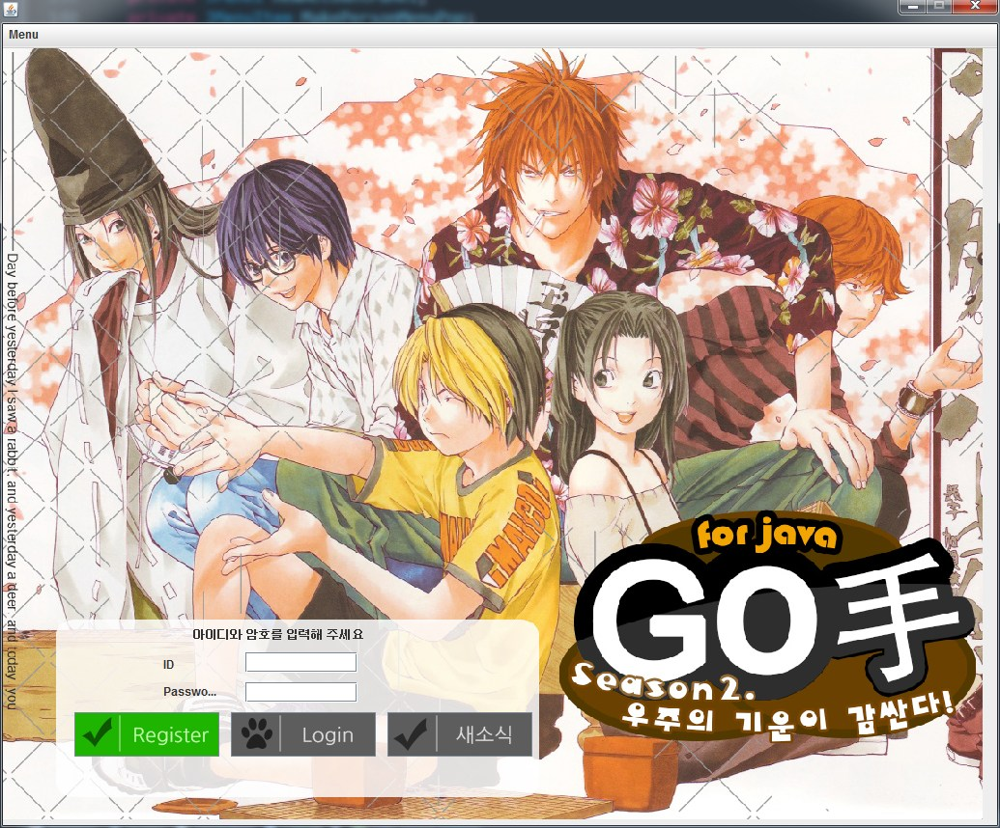
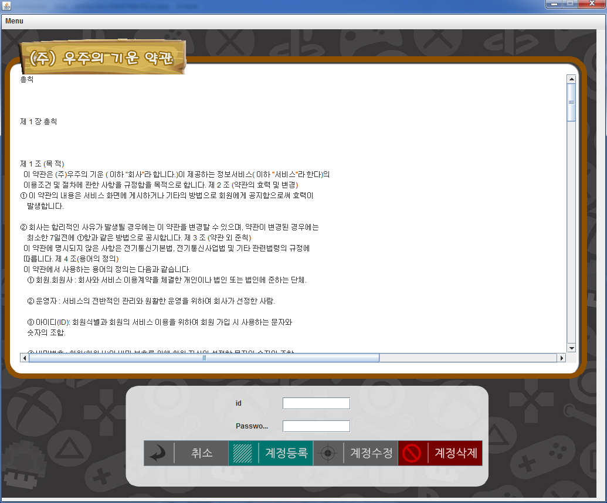
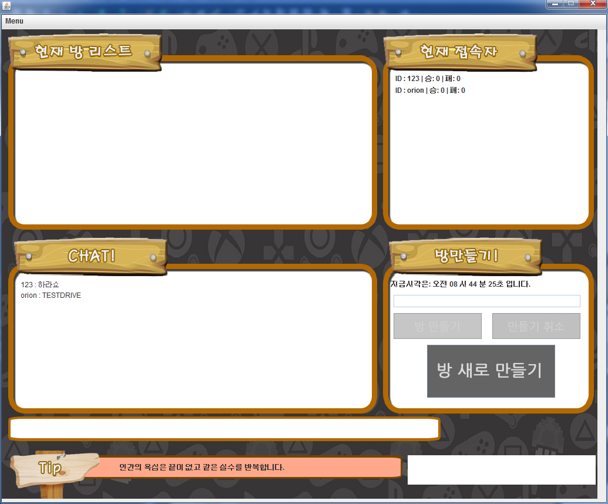
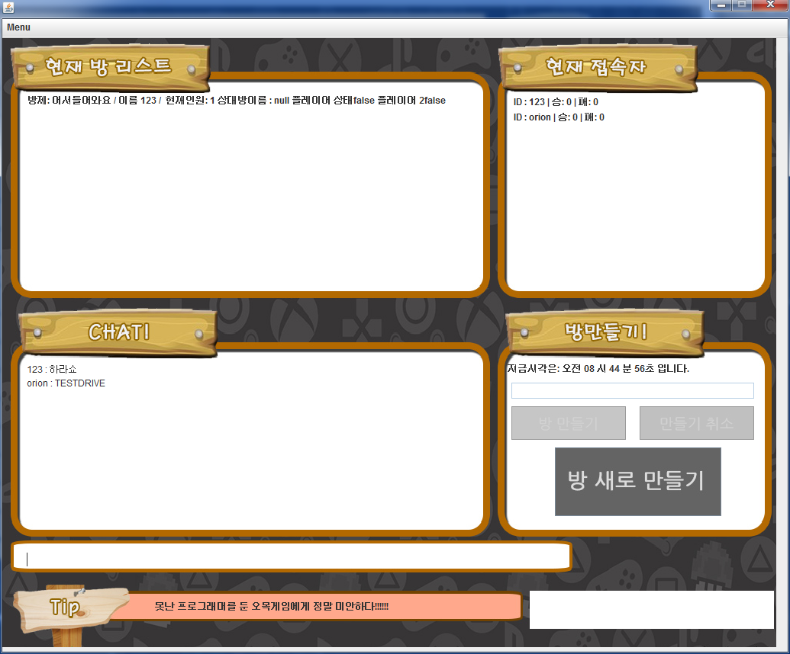
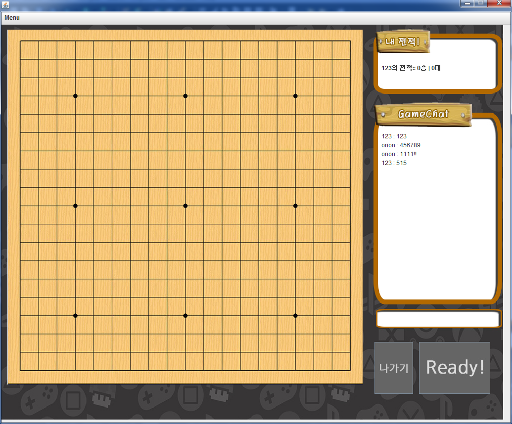
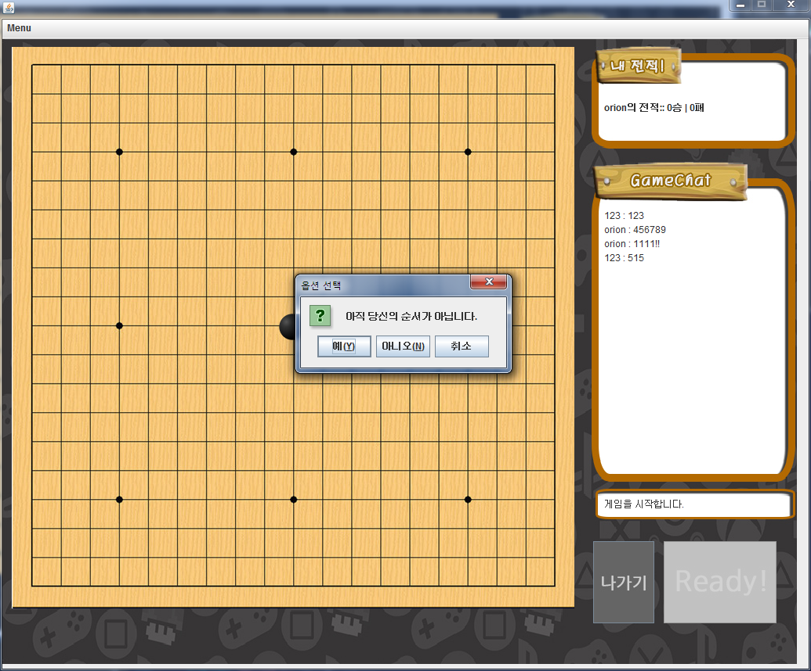
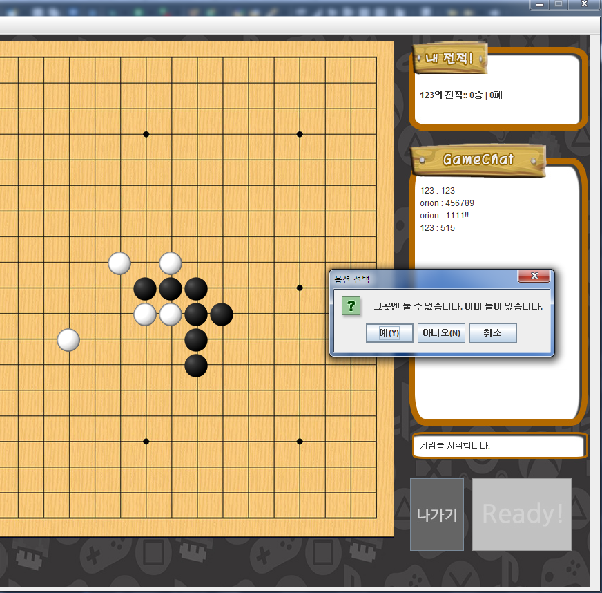
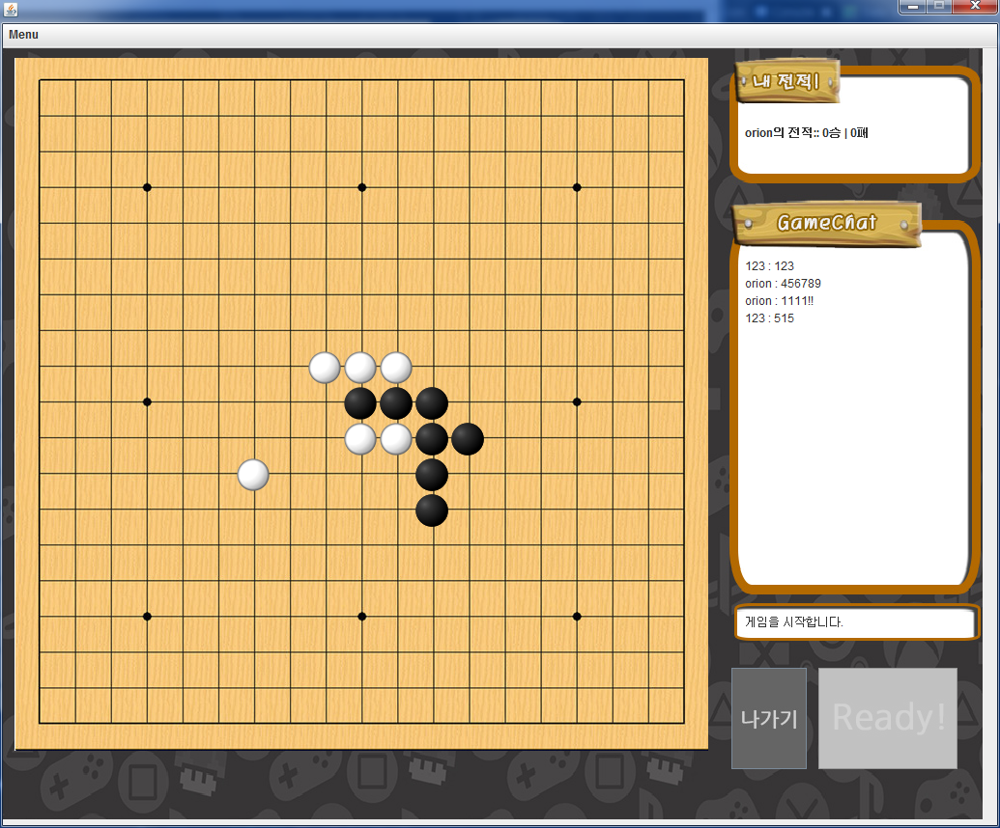
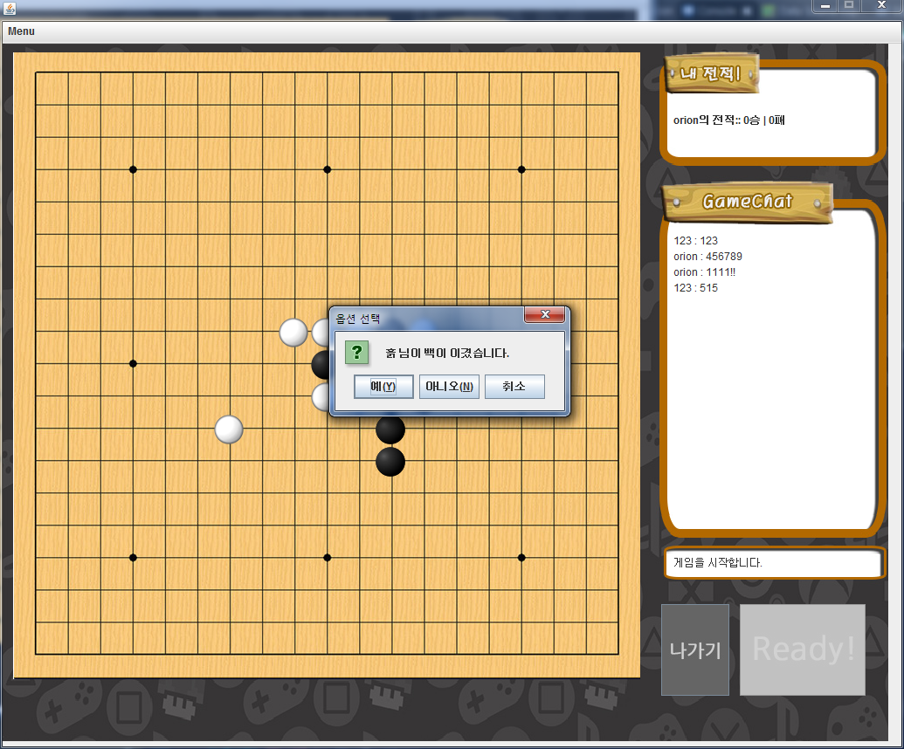
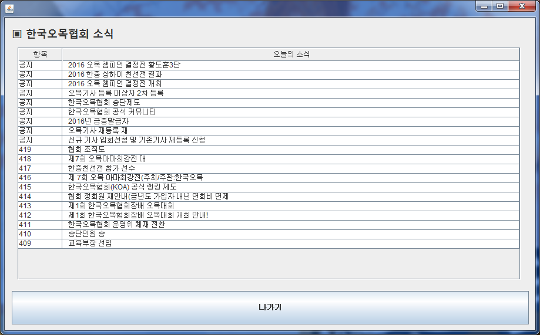

# OnlineOmok Game (java Swing project)

Online Omok Project. used Java(Swing And Socket)

온라인 오목게임입니다. 무역아카데미 SCit master의 1차과제. 

온라인에서 방을 만들고 대전을 하고 채팅이 가능하게 만들었습니다.

Swing을 이용했습니다. 

Java 1.8 + oracle Sql

# 구동화면

 

 

 

 

 

 

 

 

 

 

 

